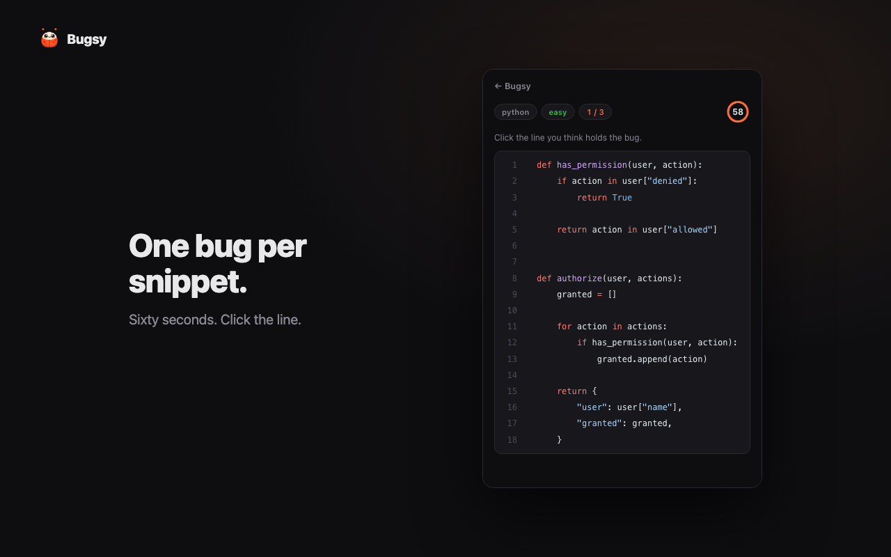
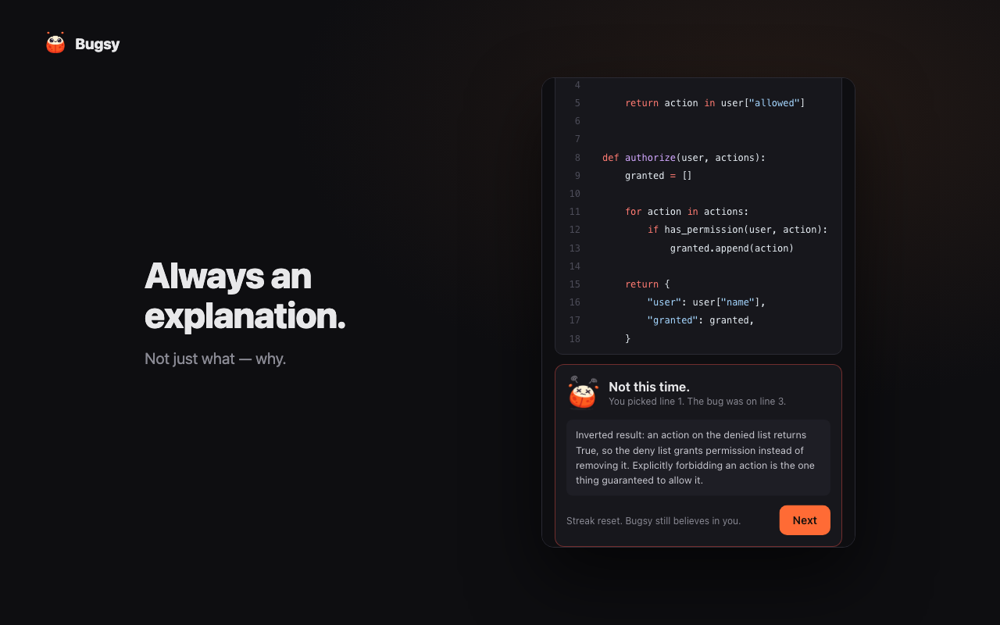
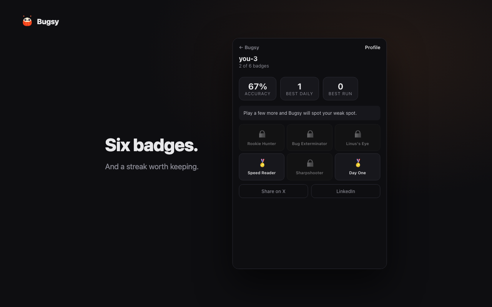

# Bugsy 🐛

**Wordle for debugging.** A Chrome extension that shows you a short, real-looking code snippet with exactly one bug in it. Click the buggy line before the timer runs out. Every answer comes with an explanation, because the point is to get better, not just to score.

<p align="center">
  
  
  
</p>

**350 snippets · 8 languages · 31 badges.** Three fresh bugs every day, a streak that survives only if you keep showing up, and a leaderboard you can't game.

## Try it in two minutes

```bash
cd extension
npm install
npm run dev
```

Then in Chrome: visit `chrome://extensions`, turn on **Developer mode**, click **Load unpacked**, and select `extension/dist`. Click the Bugsy icon in the toolbar.

You can play Practice immediately, as a guest, with no account and no backend running. For the daily challenge, streaks, badges and the leaderboard you need the server — see [Running the backend](#running-the-backend).

## What's in it

**A daily challenge.** Three snippets, the same three for everyone, generated server-side at midnight UTC. Miss a day and the streak resets — there is no freeze, no catch-up.

**Practice, unlimited.** Filter by language or take whatever comes.

**Language tracks.** Pick which of the eight languages your daily comes from, or leave it on Mixed.

**31 badges** in seven families: daily streaks, speed, practice runs, volume, hard bugs, one per language, and two mastery badges — Polyglot (a bug in every language) and Entomologist (every category of bug). They start hidden in your profile and land there as you earn them; the full catalogue is one tap away.

**A leaderboard**, weekly and all-time, updating live.

## The content

350 snippets across **8 languages** — 100 TypeScript, 60 JavaScript, 40 Python, and 30 each of Java, C#, C, C++ and Rust — spread over eight bug categories: `async`, `logic`, `mutation`, `null-undefined`, `off-by-one`, `scope`, `type-coercion`, `wrong-operator`. Roughly a third easy, a third medium, a third hard.

They live in `content/{language}/{category}/*.json`, one file per snippet, in the schema from [`BUGSY_SPEC.md`](BUGSY_SPEC.md) §3.1. Two gates stand between a snippet and a player:

**`node scripts/seed.ts --check`** — schema, length, `bugLine` in range and not on a blank line, no duplicate ids, the folder path agreeing with the declared language and category, and no comment or identifier that gives the answer away.

**`node scripts/verify-content.mjs`** — *compiles and runs* every snippet, and asserts it fails the way its explanation promises. Each one ships with a driver in `drivers/` that calls it with realistic inputs.

That second gate exists because of a snippet we had to delete. It was an off-by-one that read one element past the end of an array — a real defect, but `arr[arr.length]` is `undefined`, and `undefined > max` is `false`, so the function returned the **correct answer every time**. A bug that produces the right answer isn't a puzzle, it's a coin flip, and there was no evidence a player could reason from. Now nothing gets in without proof that it misbehaves.

## Why you can't cheat

The game is only interesting if the answer is genuinely unavailable until you commit to one.

**The answer never reaches the client before an attempt.** `bugLine` and `explanation` exist on the `Challenge` type; the game screen only ever holds a `PublicChallenge`, which is that type with those two fields removed. The compiler enforces it, and a test asserts it against the object's actual keys — because an accidental spread would still typecheck.

**Timing is server-side.** The clock starts when the challenge is *served*, not when the client says it did. The countdown you see is cosmetic. An attempt against a challenge that was never served, or served more than five minutes ago, is rejected.

**One attempt per challenge per mode**, enforced by a unique constraint. You can't re-roll a snippet you've already answered.

**Scoring, streaks and badges are decided in one Postgres transaction** (`submit_attempt`), never in the extension. Direct reads of the `challenges` table are revoked for `anon` and `authenticated`; everything goes through an Edge Function.

### The one rule the whole design rests on

**A snippet is either bundled or scored, never both.**

Guests play without an account, so their snippets have to work with no server — which means their answers ship inside the extension. That's harmless: a guest earns no points and appears on no leaderboard, so knowing an answer buys nothing.

It would be very harmful for the scored pool. If a scored snippet were also bundled, any signed-in player could read its bug line straight out of the extension and top the leaderboard. So `scripts/seed.ts` enforces the split: the five snippets flagged `"guest": true` are bundled and **never** inserted into Postgres; every other snippet is inserted and **never** bundled. Re-seeding also retires (`active = false`) any challenge that has left the server pool, so moving a snippet into the guest pool can't leave a live, scorable copy behind.

Both halves are tested: `contentValidation.test.ts` asserts the bundle contains only guest snippets, and `e2e.mjs` plays the entire scored pool and asserts no bundled snippet is ever served.

## Running the backend

Needs Docker.

```bash
npx supabase start          # local Postgres + auth + edge functions
npx supabase db reset       # apply migrations from scratch
node scripts/seed.ts        # validate content/ and upsert the scored pool
```

Copy `.env.example` to `.env` and `extension/.env.example` to `extension/.env`, filling both from `npx supabase status`. The extension gets the **anon** key and nothing else — the service-role key bypasses RLS and must never appear anywhere under `extension/`.

Sign-in is GitHub OAuth via `chrome.identity`. The extension ID is pinned by the `key` field in `manifest.json` so it survives reloads; the OAuth redirect URL (`https://<extension-id>.chromiumapp.org/`) is registered against it and would otherwise change on every reinstall.

## Commands

```bash
# Extension (from extension/)
npm run dev         # dev build + HMR
npm run build       # production build
npm run typecheck   # tsc --noEmit, strict
npm run test        # vitest

# Content (from the repo root)
node scripts/seed.ts --check       # validate content/, no DB needed
node scripts/seed.ts --emit        # rebuild the guest bundle
node scripts/verify-content.mjs    # compile and RUN every snippet

# End-to-end, against the local stack
node supabase/tests/e2e.mjs        # practice, anti-cheat, pool separation, leaderboard
node supabase/tests/e2e-daily.mjs  # daily set, streak engine
node supabase/tests/e2e-badges.mjs # the 31-badge engine, thresholds included
```

`--emit` runs automatically before dev, build, typecheck and test, so the guest bundle is never stale.

## Layout

```
extension/
  src/popup/        game UI (React)
  src/background/   service worker: toolbar badge, alarms, notifications
  src/components/   CodeViewer, Timer, ResultCard, AllBadges, Bugsy…
  src/lib/          api contract, scoring, streaks, badges, highlighting, storage
  src/types/        shapes mirroring the DB schema + Edge Function contracts
content/            snippet JSON, one file each
drivers/            one executable driver per snippet, for verify-content
scripts/            content validator, seeder, snippet runners
supabase/
  migrations/       schema, RLS, submit_attempt, daily sets, badge catalogue
  functions/        get-practice, get-daily, submit-attempt
  tests/            end-to-end suites
store/              Chrome Web Store listing, privacy policy, screenshots
```

The product spec — scoring formula, badge rules, screen-by-screen copy — is [`BUGSY_SPEC.md`](BUGSY_SPEC.md).
